# Django Hello World
本项目是[菜鸟教程](https://www.runoob.com/django/django-tutorial.html)的复刻，也是本人在校数据库课程的上机作业。

- 为了方便调试，添加了站点导航以及每个页面的导航。

- 为了方便mysql的配置，使用**docker-compose**搭建了mysql+django的容器组合，clone本项目后在根目录运行：

```bash
docker-compose up -d --build
```

即可一键运行服务（web服务映射在本机的8000端口）：

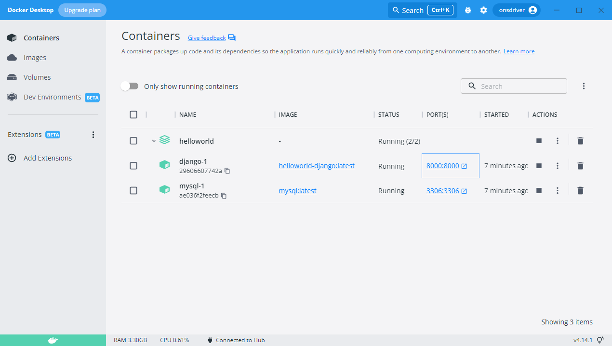

## 预览

### 首页
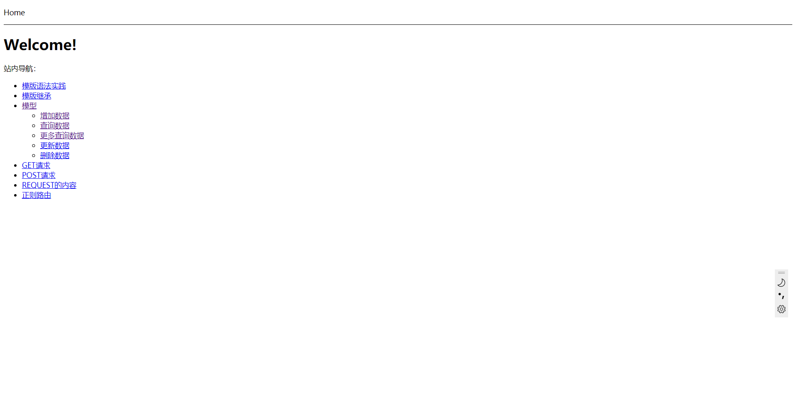
### Django模版语法实践
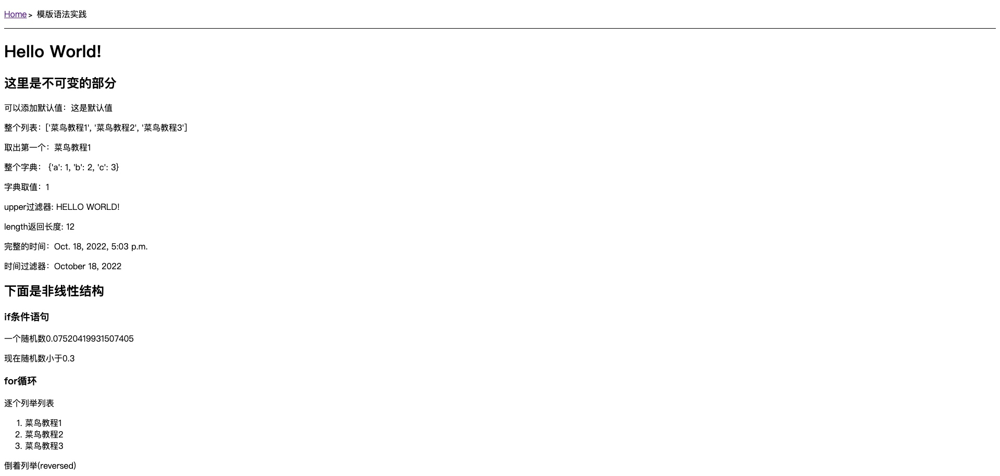
### 模型
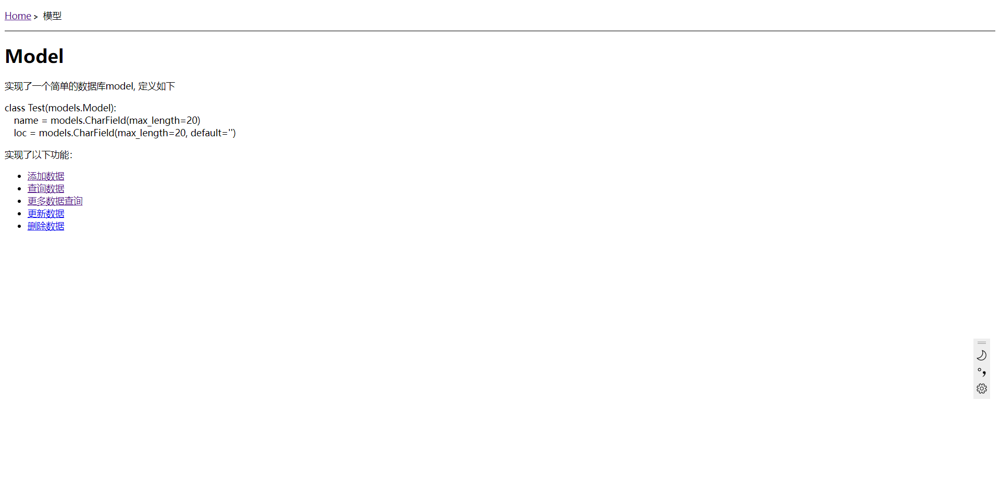

#### 添加数据（利用POST请求实现

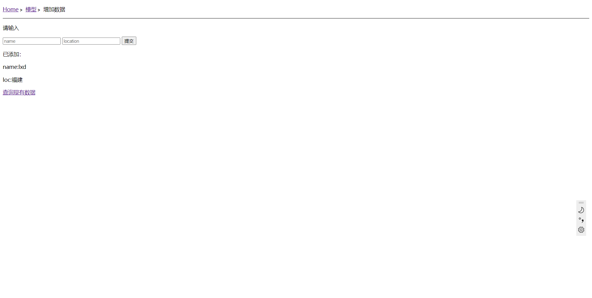

#### 查询数据

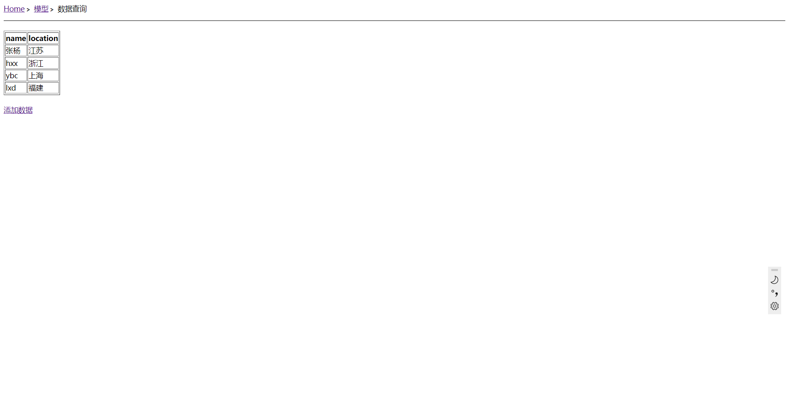

#### 更多查询数据（利用GET请求实现

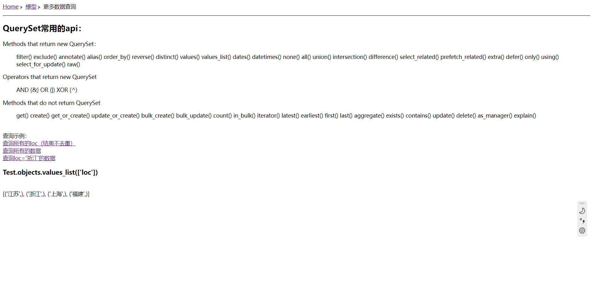

#### 更新数据（利用GET请求实现

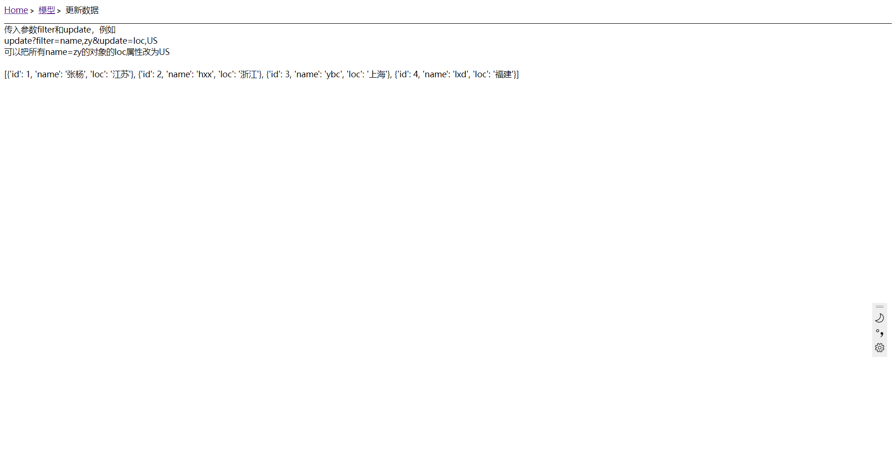

#### 删除数据（利用GET请求实现

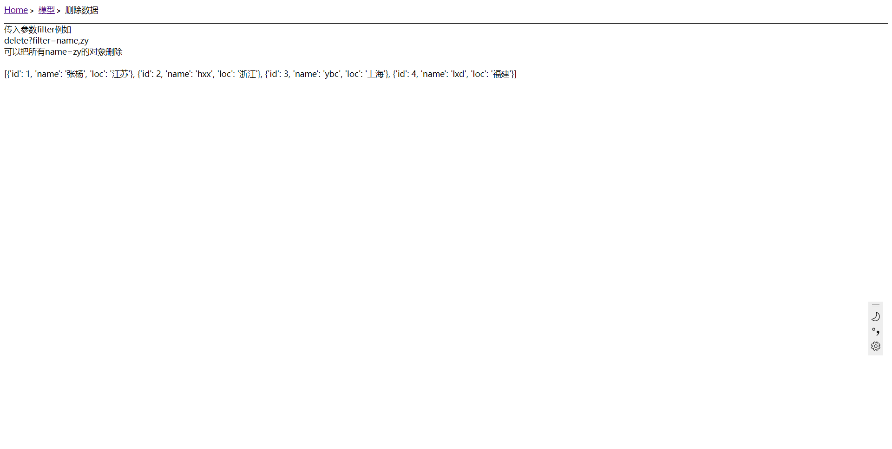

### GET请求

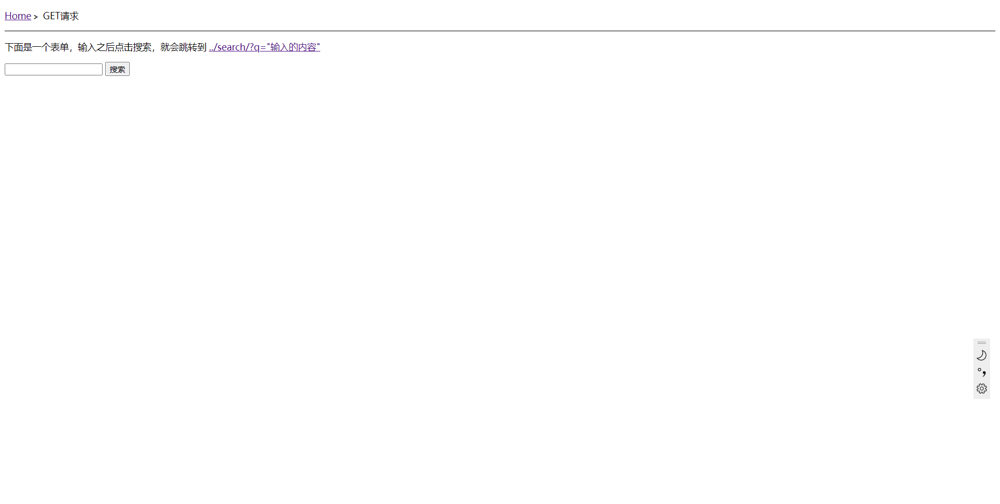

### POST请求

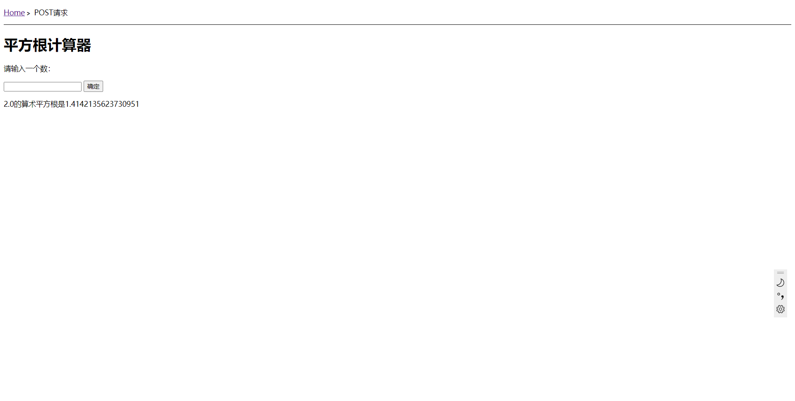
